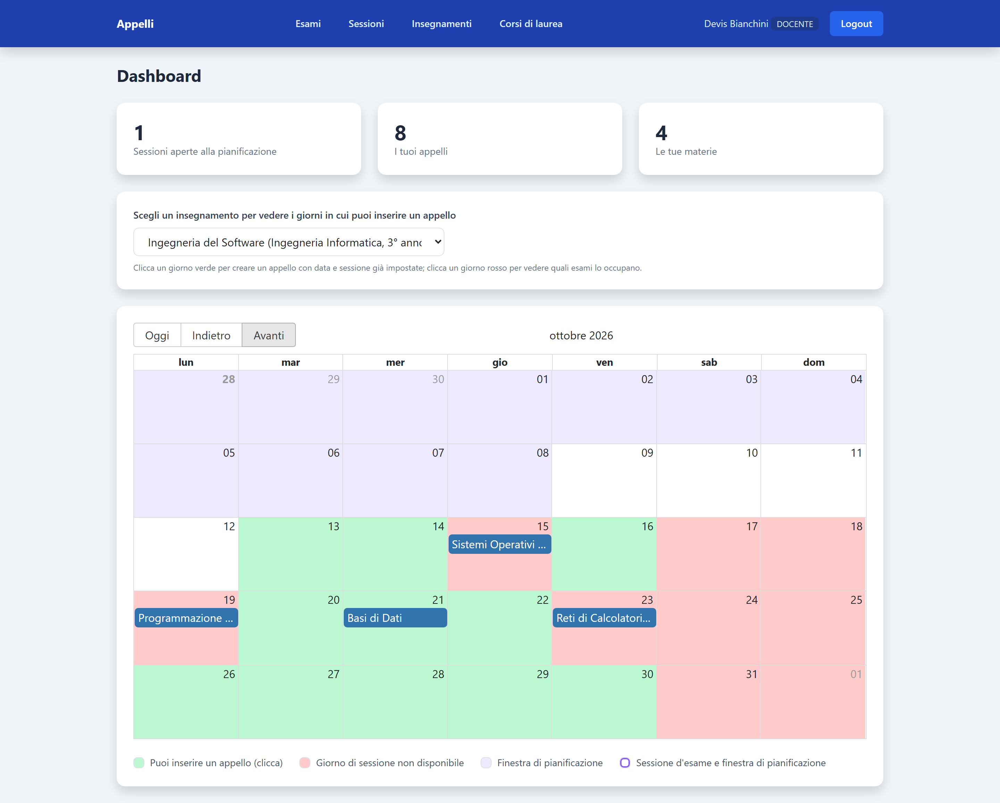
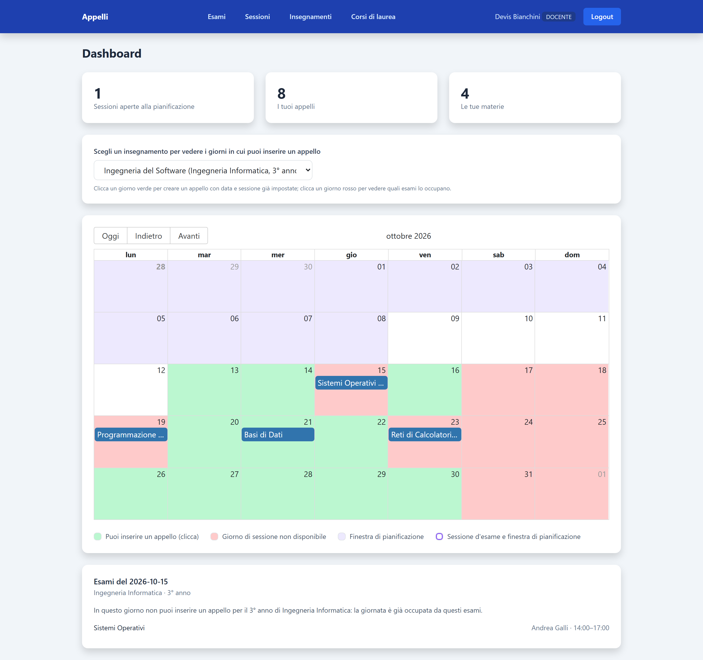
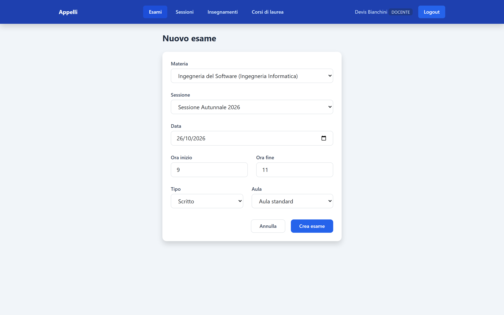
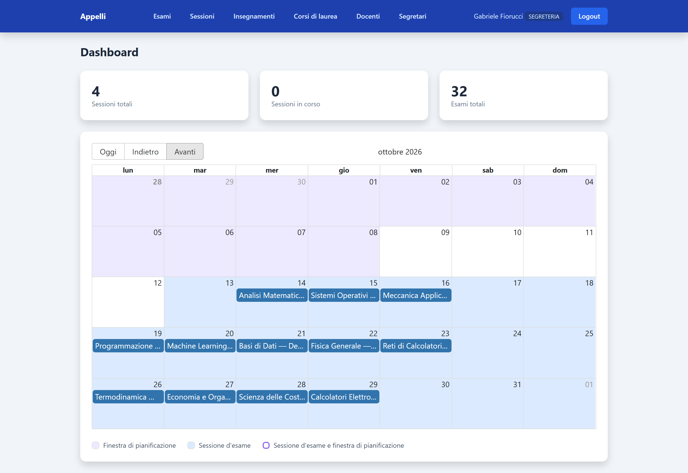
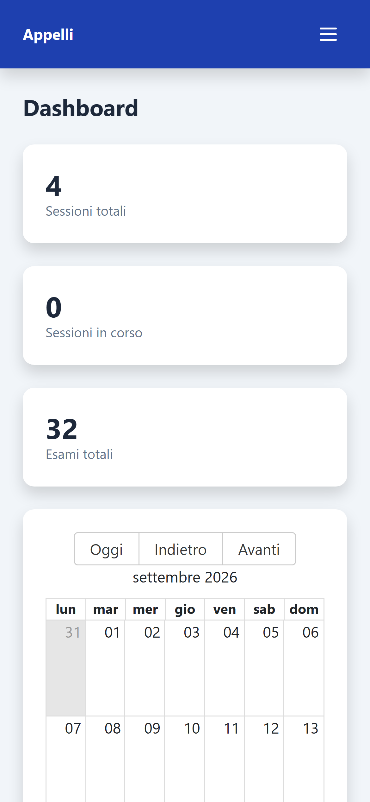

# PFSProject

**Una web app che porta online l'organizzazione degli appelli d'esame.** La
segreteria apre le sessioni, il docente sceglie il giorno su un calendario che
gli mostra in verde dove può mettere il suo esame e in rosso dove non può, e il
sistema controlla da solo che non ci siano conflitti, weekend o date fuori tempo
massimo.

È un **progetto didattico**, nato nel corso di Progettazione di Applicazioni Web
Full Stack per proporre un'alternativa all'attuale metodo di inserimento e
gestione degli esami all'Università degli Studi di Brescia.

**Scheda del progetto, con immagini e video: [fioruccilabs.com/progetti/pfsproject](https://fioruccilabs.com/progetti/pfsproject/)**




## L'idea

Ogni sessione d'esame comincia con un puzzle. Decine di docenti devono scegliere
le date dei propri appelli, e quelle date devono incastrarsi: due esami dello
stesso anno dello stesso corso nello stesso giorno significano studenti costretti
a scegliere quale saltare. Oggi buona parte di questo lavoro passa per proposte,
verifiche incrociate e controlli fatti a mano tra docenti e segreteria.

PFSProject parte da una domanda semplice: *e se fosse il calendario stesso a
sapere quali giorni sono liberi?* Il docente vede subito dove può mettere il suo
esame, e le regole sono scritte nel sistema, uguali per tutti.

## Come funziona

1. **La segreteria apre la sessione**, indicando due periodi distinti: *quando*
   si svolgono gli esami e *quando* i docenti possono pianificarli.
2. **Il docente sceglie il giorno.** Seleziona un insegnamento e il calendario si
   colora: **verde** dove può inserire un appello, **rosso** dove la giornata è
   già occupata da un altro esame dello stesso corso e anno, oppure cade nel
   weekend. Se si clicca su un giorno rosso, il sistema spiega *perché* non è
   disponibile e mostra quali esami lo occupano.
3. **Un clic, e l'appello è pronto.** Su un giorno verde si apre il modulo con
   materia, sessione e data già compilate: restano solo l'orario, il tipo di
   esame e l'aula.
4. **Tutto in ordine, per ogni sessione.** Il docente ritrova i propri appelli
   raggruppati per sessione; quelli già svolti restano visibili come *Esame
   concluso*.

| Un giorno già occupato | Nuovo appello precompilato |
|---|---|
|  |  |

## Il calendario conosce le regole

I vincoli sono verificati dal server, quindi valgono anche se qualcuno prova ad
aggirare l'interfaccia:

- **Niente sovrapposizioni.** Per uno stesso corso di laurea e uno stesso anno
  esiste al massimo un esame al giorno.
- **Niente duplicati.** Una materia ha un solo appello per sessione.
- **Niente weekend.** Sabato e domenica non si pianifica.
- **Rispetta le scadenze.** Gli appelli si inseriscono solo durante la finestra
  di pianificazione, e la data deve cadere dentro il periodo della sessione.
- **A ciascuno il suo.** Il docente crea appelli solo per le proprie materie e
  modifica solo i propri esami.

Quando qualcosa non va, il messaggio d'errore dice esattamente cosa correggere.

## Due ruoli, una sola applicazione

Dopo il login l'applicazione apre automaticamente l'area giusta.

- **Il docente** vede le sue materie, i suoi appelli, le sessioni aperte e il
  calendario personalizzato.
- **La segreteria** ha la vista d'insieme: il calendario di tutto l'ateneo e il
  controllo completo su sessioni, corsi di laurea, insegnamenti e account. Ogni
  nuovo account nasce in un colpo solo, utente e profilo insieme: se qualcosa va
  storto a metà, non resta nulla di incompleto.

L'interfaccia si adatta anche al telefono: il menu si richiude, le tabelle si
compattano e il calendario resta consultabile.

| La dashboard della segreteria | Dal telefono |
|---|---|
|  |  |

I video della demo sono in [`docs/portfolio/video`](docs/portfolio/video) e sulla
[scheda del progetto](https://fioruccilabs.com/progetti/pfsproject/).

## Com'è fatto

Un monorepo **Nx**: front-end e back-end nello stesso workspace, con i tipi
condivisi tra i due. Il front-end in **React 19** e **Vite** parla con un'API
REST in **NestJS 11** tramite HTTP e token **JWT**; il back-end applica le regole
di dominio e le guardie sui ruoli, e salva i dati in **PostgreSQL** attraverso
**TypeORM**, dove i vincoli di unicità vengono tradotti in messaggi chiari.

```
apps/
  api/                   API NestJS (prefisso /api, documentazione Swagger su /api/docs)
  ui/                    front-end React + Vite
libs/
  database/              connessione a PostgreSQL (TypeORM)
  server/auth/           login e token JWT
  server/security/       ruoli e guardie
  server/users/          utenti
  server/exam-planning/  sessioni, appelli, insegnamenti, corsi di laurea, docenti, segreteria
docs/                    modello ER, progetto coarse, schema dell'ipertesto, screenshot e video
```

Prima del codice, la progettazione: il [modello ER](docs/er/modello-er.png), il
[progetto coarse](docs/Coarse/Diagramma%20Coarse.drawio.png) e lo
[schema dell'ipertesto](docs/Diagramma%20Ipertesto/Diagramma%20ipertesto.drawio.png).

## Avvio in locale

Servono **Node.js** (20 o successivo) e **PostgreSQL**.

1. Installa le dipendenze:
   ```bash
   npm install
   ```
2. Copia `.env.example` in `.env` e compila i valori: credenziali di PostgreSQL e
   `SECRET_KEY` per la firma dei JWT. Crea in PostgreSQL il database indicato in
   `PG_DATABASE` (le tabelle vengono create all'avvio).
3. (Facoltativo) Carica i dati di prova, con sessioni passate, in corso e future
   e alcuni account di docenti e segreteria (vedi `apps/api/src/seed.ts`):
   ```bash
   npm run seed
   ```
4. Avvia API e front-end insieme:
   ```bash
   npm run dev
   ```
   - Applicazione: <http://localhost:4200>
   - API: <http://localhost:3333/api>
   - Documentazione delle API (Swagger): <http://localhost:3333/api/docs>

Test: `npx nx run-many -t test`.

## Il progetto in breve

| | |
|---|---|
| **Cos'è** | Una web app per pianificare gli appelli d'esame universitari, con un calendario che applica da solo le regole |
| **Per chi** | Segreterie didattiche e docenti |
| **Piattaforma** | Web, da computer e da telefono |
| **Lingua** | Italiano |
| **Realizzato con** | TypeScript, React, NestJS, PostgreSQL, TypeORM, Nx |
| **Contesto** | Corso di Progettazione di Applicazioni Web Full Stack, Università degli Studi di Brescia |
| **Autore** | Gabriele Fiorucci: progettazione, sviluppo back-end e front-end |

## Sviluppi futuri

1. Accesso con le credenziali d'ateneo (SSO), senza account separati
2. Gestione delle aule: capienza, disponibilità e prenotazione automatica
3. Area studenti per consultare il calendario degli appelli del proprio corso
4. Notifiche via email all'apertura e alla chiusura delle finestre di pianificazione
5. Esportazione del calendario (PDF, iCal) e integrazione con i sistemi dell'ateneo
